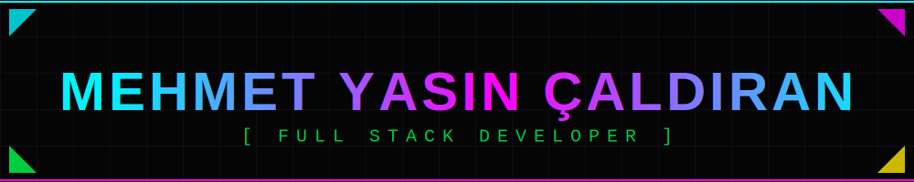

  

  

  
  
  
  

 

  

 

<h3 align="center" style="font-family: monospace; color: #00f3ff;">⚡ SYSTEM_CAPABILITIES ⚡</h3>

  

 

<h3 align="center" style="font-family: monospace; color: #ff00ff;">💾 PROJECT_DATABASE_V2.0</h3>

| 📂 PROJECT | 📝 DESCRIPTION | 🛠️ TECH | 🔗 LINK |
|:---:|:---:|:---:|:---:|
| **Unlu Mamüller System** | 🛒 POS, QR Order & Stock Management System | `Kotlin` `PHP` `MySQL` | [Access Denied] |
| **FlyLetter** | 💬 Animated Social Messaging App | `Kotlin` `Firebase` `Anim` | [Access Denied] |
| **Cyber Portfolio** | 🌐 3D Personal Web Experience | `Three.js` `WebGL` `Cyberpunk` | [View Source] |
| **SecureVault** | 🔐 Encrypted File Storage | `C#` `AES-256` | [View Source] |
| **AutoBarcode** | 🏷️ Hardware Integration Service | `C++` `Serial Port` | [View Source] |

 

<h3 align="center" style="font-family: monospace; color: #0aff0a;">📊 GITHUB_METRICS</h3>

  
  

  

 

  

<!-- 
HIDDEN SYSTEM LOGS FOR EXTRA LENGTH AND FLAVOR
[SYSTEM]: Initializing connection...
[SYSTEM]: Handshake successful.
[SYSTEM]: User 'LeOOqq' authenticated.
[SYSTEM]: Loading assets...
[SYSTEM]: Assets loaded: header.svg, terminal.svg, skills.svg.
[SYSTEM]: Rendering interface...
[SYSTEM]: Interface rendered.
[SYSTEM]: Monitoring user activity...
[SYSTEM]: No threats detected.
[SYSTEM]: Firewall active.
[SYSTEM]: Encryption: AES-256.
[SYSTEM]: Location: Turkey.
[SYSTEM]: University: ISTE.
[SYSTEM]: Department: Computer Engineering.
[SYSTEM]: GPA: 3.28.
[SYSTEM]: Status: Active.
[SYSTEM]: Mode: Cyberpunk.
[SYSTEM]: End of log.
-->
